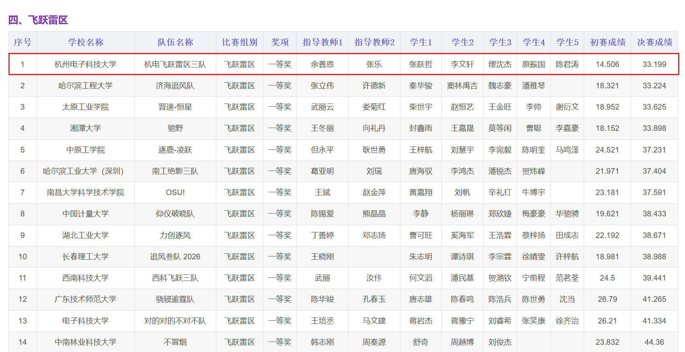
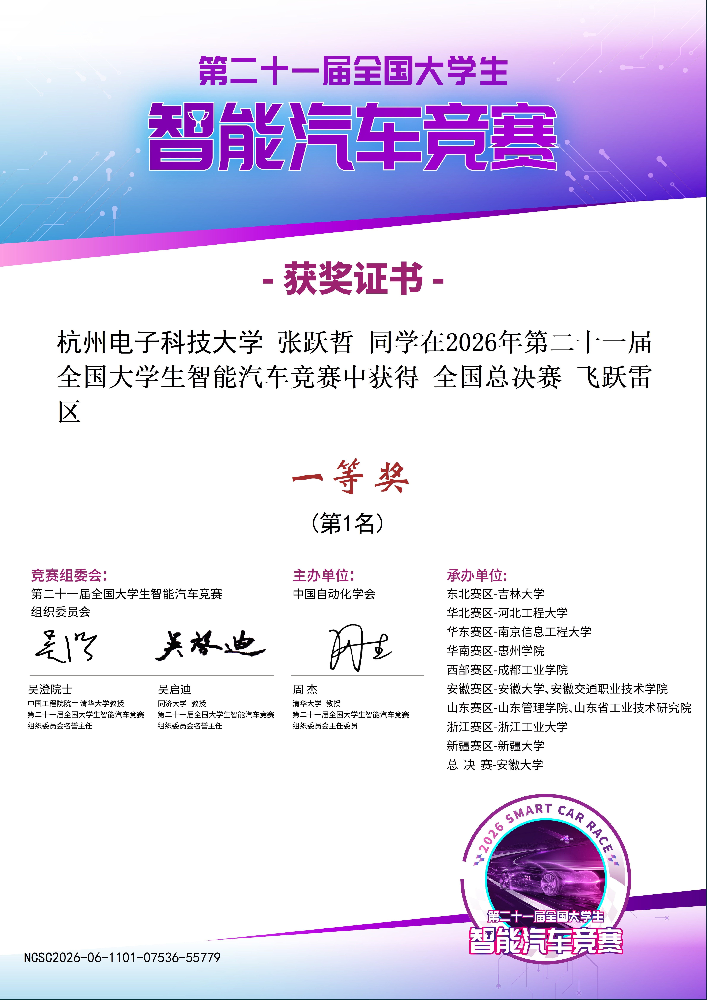
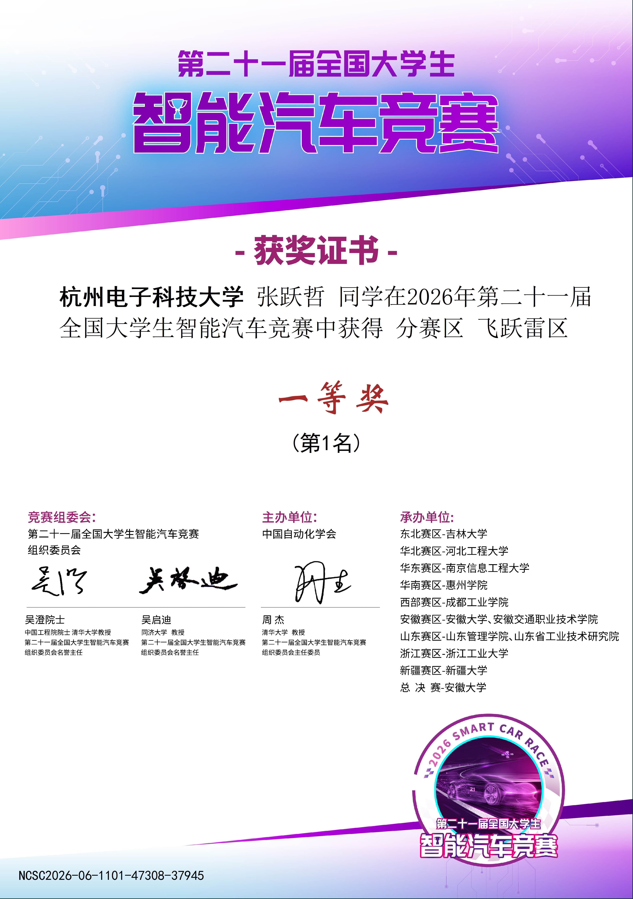

# 第 21 届全国大学生智能汽车竞赛：飞跃雷区全国冠军开源

> 2026 年，杭电飞跃雷区三队参加第 21 届全国大学生智能汽车竞赛“飞跃雷区”组，获得全国总决赛冠军。这里是整套项目的母仓库，代码、PCB、结构件、调试工具和文档都从这里开始找

## 比赛规则前情提要

- [**总规则**](https://blog.csdn.net/zhuoqingjoking97298/article/details/154598625)
- [**雷区规则**](https://blog.csdn.net/zhuoqingjoking97298/article/details/154691546)
- [**雷区的QA补充**](https://zhuoqing.blog.csdn.net/article/details/157686655)
- [第二十一届全国大学生智能车竞赛全国总决赛（竞速组别）成绩与奖项](https://blog.csdn.net/zhuoqingjoking97298/article/details/164053403)

大致规则为 : 使用指定MCU进行手搓飞控 , 自制无人机和车模 , 使用不长于1.5米的供电线缆进行供电 , 只允许无人机安装摄像头 , 实现车模自动熄灭信标灯的操作 , 比拼灭掉同样的灯谁花费的时间更少

## 队伍成绩

<p align="center">
  
</p>

决赛因为图像问题很严重 , 没能发挥出正常的水平 , 其实前四名的排序就是纯运气。实验室里调试出来的最快速度可以达到26秒左右 , 预赛成绩是遥遥领先的 , 可以查看视频

[【21届智能车杭电飞跃雷区三队预赛14.5s杀死比赛】](https://www.bilibili.com/video/BV1hkh36wECt/)

## 获奖证书

<p align="center">
  
  
</p>

## 先看这里

如果只想先了解我们做了什么，建议按这个顺序：

1. [【21届智能车杭电飞跃雷区三队预赛14.5s杀死比赛】](https://www.bilibili.com/video/BV1hkh36wECt/)
2. [有些故事，适合留在最好的时候](https://www.bilibili.com/video/BV17L8J6fEYQ/)
3. [国赛结构讲解视频](https://www.bilibili.com/video/BV1894o62Ej4/)
4. [上位机调试路径规划和图像兜底](https://www.bilibili.com/video/BV1Rm4m6fEMv/)
5. [Air 飞控最新总文档](https://github.com/ZhangStudyLife/CYT4BB7_Air/blob/national-2026/README.md)
6. 再根据下面的模块入口，跳到自己真正关心的部分。

## 我们做的是什么

这是一个空地协同的智能车项目：无人机在空中识别地面信标和车灯，把视觉结果、飞机姿态和高度等信息交给飞控；飞控经过相机模型、三摄融合和路径规划，计算车模应该行驶的方向和速度；车模再执行速度控制，并把实际速度回传给飞机。

简单说就是：

```text
空中图像板识别信标 / 车灯
        ↓ SPI
CYT4BB7_Air：双核飞控、姿态高度、相机模型、CarPlan3
        ↓ AirComm UART
CYT4bb7_Car：麦轮控制、编码器、里程计和车模执行
```

## 我在这个项目遇到的难点

1. 前期对于飞控了解不够多 , 电机选型、桨叶选型、对比众多开源飞控的区别 , 都花费了很多时间
2. 硬件画板能力和迭代速度导致前期飞机结构非常非常差劲(前硬件队友就是摆子,四月份没画出有刷驱动,后面换了大一学弟,毕竟是学弟要求不能这么高了,但客观而言硬件拖慢了整体的进度,六月份才刚有第一版电调可用,包括前期的三摄方案也因为硬件问题推进了两个月没硬件供我调试)
3. 高度传感器的选型研究了很久,寒假期间花费很多时间在气压计上面
4. 光流的选型和融合 , 这个无人机的水平速度环从3月份调到7月份
5. 多摄像头的摆放位置 , 前期摆放使用 3个摄像头互相夹角60°
6. 队伍内没有专业的结构 , 导致结构设计每次都要迭代三四次才会初具人形,队友初次绘制的机架花费了800大洋,厚度打了8mm,跟坦克一样根本不可起飞
7. 图像算法反馈的image_data可用性很低 ,导致路径算法一直在做兜底

## 忆往昔

从大一一开学做实验室考核任务接触智能车 , 到学长引荐打 NXP 平衡竞速组 , 再到这一届飞跃雷区 , 这一路的风和雨单独写成了一篇回忆录 :

[忆往昔](./忆往昔.md)

## 核心入口

各模块当前使用的最新版本如下：

| 模块     | 最新版本                                                                                                                                                                                   |
| -------- | ------------------------------------------------------------------------------------------------------------------------------------------------------------------------------------------ |
| 国赛结构 | [当前国赛结构文件](./structure/national/)                                                                                                                                                   |
| 省赛结构 | [当前省赛结构文件](./structure/provincial/)                                                                                                                                                 |
| 硬件 PCB | [当前 PCB 源文件](./hardware/boards/)                                                                                                                                                       |
| Air 飞控 | [Air 最新总文档](https://github.com/ZhangStudyLife/CYT4BB7_Air/blob/national-2026/README.md)                                                                                                |
| 图像板   | [Image 最新仓库](https://github.com/ZhangStudyLife/CYT2BL3_Image/tree/national-2026)                                                                                                        |
| 上位机   | [上位机最新主文档](https://github.com/ZhangStudyLife/BeaconImageAnalyzer/blob/main/README.md)；[CarPlan 分支](https://github.com/ZhangStudyLife/BeaconImageAnalyzer/blob/car_plan/README.md) |
| 车端     | [Car_F 国赛分支](https://github.com/ZhangStudyLife/CYT4BB7_Car_F/tree/national-2026)；[Car 仓库](https://github.com/choumouing/CYT4bb7_Car/tree/national-2026)                               |

Car 端的具体文档目前不是这套开源内容的主线，先把它作为完整工程入口保留。真正想理解“飞机为什么能让车跑起来”，建议先看 Air、硬件和结构，再回头看 Car。

## 按目标阅读

### 只想了解比赛方案

先看本页的[整体方案](#我们做的是什么)，然后看[结构总文档](./structure/README.md)和[硬件 PCB](./hardware/README.md)。结构总文档会直接引流国赛/省赛视频和对应的 SolidWorks 文件，这条路线能先建立“最终拿去比赛的东西长什么样”的概念。

### 想理解无人机飞控

进入 [Air 最新总文档](https://github.com/ZhangStudyLife/CYT4BB7_Air/blob/national-2026/README.md)，按“软件架构 -> IMU -> 高度 -> 遥控器/CRSF -> 通信”的顺序读。Air 文档会再跳到具体源码和实验记录。

### 想理解图像到路径规划

进入 Air 的[相机模型标定](https://github.com/ZhangStudyLife/CYT4BB7_Air/blob/national-2026/docs/03-competition/camera-model-calibration.md)，再看 [CarPlan3 上位机调试流程](https://github.com/ZhangStudyLife/CYT4BB7_Air/blob/national-2026/docs/03-competition/car-plan3-debug-workflow.md)。这两篇会解释为什么不能只在像素域里看一条曲线，以及如何通过日志回放区分视觉、几何、规划和底盘问题。

### 想复现上位机调试

先看[上位机调试视频](https://www.bilibili.com/video/BV1Rm4m6fEMv/)，再进入 [BeaconImageAnalyzer 最新主文档](https://github.com/ZhangStudyLife/BeaconImageAnalyzer/blob/main/README.md)。如果要看 CarPlan3 专用版本，进入它的 [`car_plan` 分支 README](https://github.com/ZhangStudyLife/BeaconImageAnalyzer/blob/car_plan/README.md)。

## 仓库结构

```text
.
├─ hardware/                  PCB 源文件、板卡照片和硬件迭代记录
├─ structure/                 国赛、省赛结构件和结构说明
├─ CYT4BB7_Air/               空中控制端代码和飞控文档
├─ CYT2BL3_Image/             摄像头采集与图像识别代码
├─ BeaconImageAnalyzer/       WiFi/JustFloat 接收、记录和回放工具
├─ CYT4bb7_Car/               车端代码
└─ CYT4BB7_Car_F/             另一套车端国赛工程
```

`hardware/` 和 `structure/` 是母仓库自己的内容；Air、Image、Car 和上位机是独立子仓库。不要在 Air 里寻找 PCB 源文件，也不要把总仓库固定的子模块提交当成远端子仓库的最新版本。

## 克隆和版本关系

直接浅克隆当前完整工程（包括所有子仓库）：

```bash
git clone --branch national-2026 --single-branch --depth 1 --recurse-submodules --shallow-submodules https://github.com/ZhangStudyLife/HDUASC-SmartCar-21st-FlyOverMinefield.git
```

该命令会同时浅克隆总仓库和全部子仓库，并检出总仓库记录的固定子模块版本。其中，`--recurse-submodules` 用于一并初始化所有子仓库，`--shallow-submodules` 用于让子仓库也只获取浅层历史。

由于 Car 子仓库历史提交较多，且前期提交包含了过多的飞行日志，完整克隆需要下载较多历史数据，速度较慢，因此建议使用上述浅克隆命令。

如果需要各子仓库的远端最新提交，而不是总仓库记录的固定版本，请先确认接口兼容性，再单独更新相应子仓库。

如果只是想看子仓库远端的最新内容，请使用上面“核心入口”里的 GitHub 最新入口，不要直接在本地执行 `git submodule update --remote` 后就认为它和总仓库已经匹配。主动更新子仓库后，必须检查接口兼容性，再决定是否提交新的子模块指针。

[Air 飞控最新总文档](https://github.com/ZhangStudyLife/CYT4BB7_Air/blob/national-2026/README.md) ・ [硬件 PCB 总文档](./hardware/README.md) ・ [结构总文档](./structure/README.md)

## 许可与署名要求

商业使用本仓库文档时，请保留并正确标注作者署名，遵守 CC BY 4.0 的署名要求。

使用、修改或传播本仓库的文档或代码时，不得以任何方式暗示作者、作者所在学校或相关竞赛成绩对你的产品、服务或宣传提供赞助、认可或背书。尤其不得利用作者姓名、学校名称或“全国冠军”等表述，为在闲鱼等平台销售的代码、文档或相关服务进行宣传或背书。

以上说明旨在明确署名与非背书要求，不改变 CC BY 4.0 或 GPL v3.0 允许的使用、修改、传播和商业利用范围。
