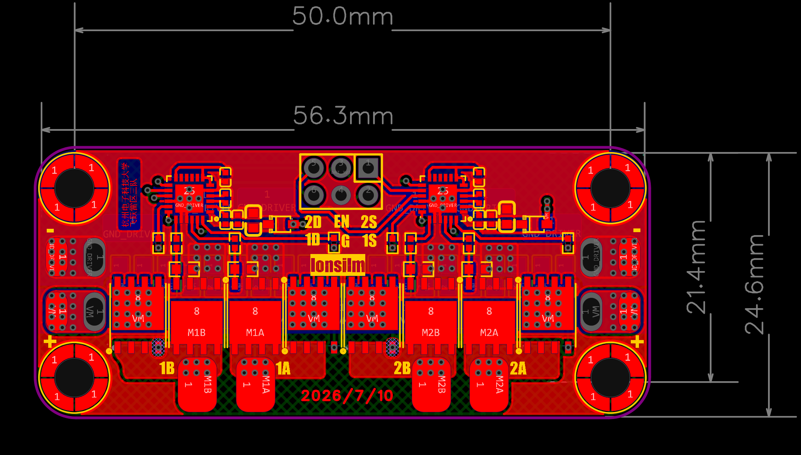

# 双路有刷驱动（BrushedDriver）迭代记录

用的是DRV8701E作为预驱芯片，然后选择用BSC030N08NS5作为MOS管

有刷驱动属于是实验室寒假期间的任务，其原理也就是一个H桥电路，用于电机的换向，第二就是进行功率的放大

## 迭代

所以在过过逐飞一次板之后进行了一次迭代之后有刷驱动属于一直相对比较稳定，所以没什么迭代经历

相对逐飞其实砍掉了很多功能，像是为了nSLEEP使能的降压这个就删掉了，不能用外置开关，只能用主板上的引脚输出电平高低来进行控制有刷驱动的开关

## 器件选型与踩坑

这个MOS管的选型现在看来是有点性能过剩，不过在整个备赛过程中预驱几乎没怎么损坏过，不过也是有优化空间的，像是自举电容的选型可以更换为0603，高耐压的0402 100nf的电容相对而言都是比较罕见的，当初为了美观就没考虑这方面，同时之前有一次有刷板坏掉的原因是0402的自举电容因为车辆振动严重直接连着焊盘一起被震下来了

## 总结

然后就没有什么好说的了，有刷电机在智能车这种相对强调竞速的比赛中实际上是存在明显的上限的，在换成F车之后每完赛三次就有刷电机因高温导致磁钢退磁、性能明显下降，维持不了开赛时的速度。
