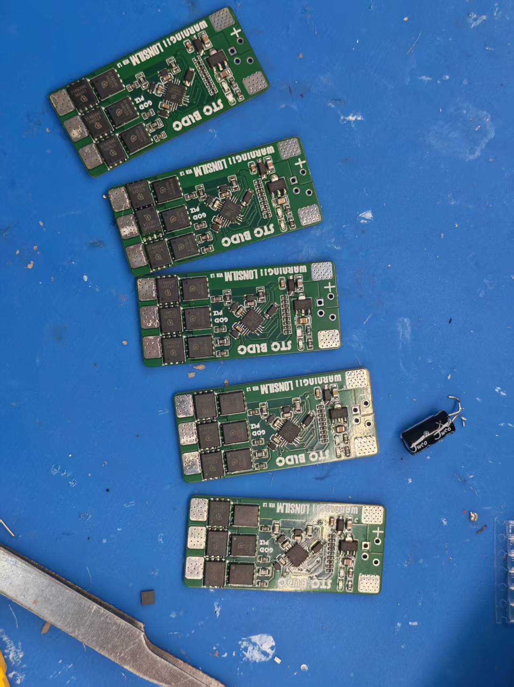
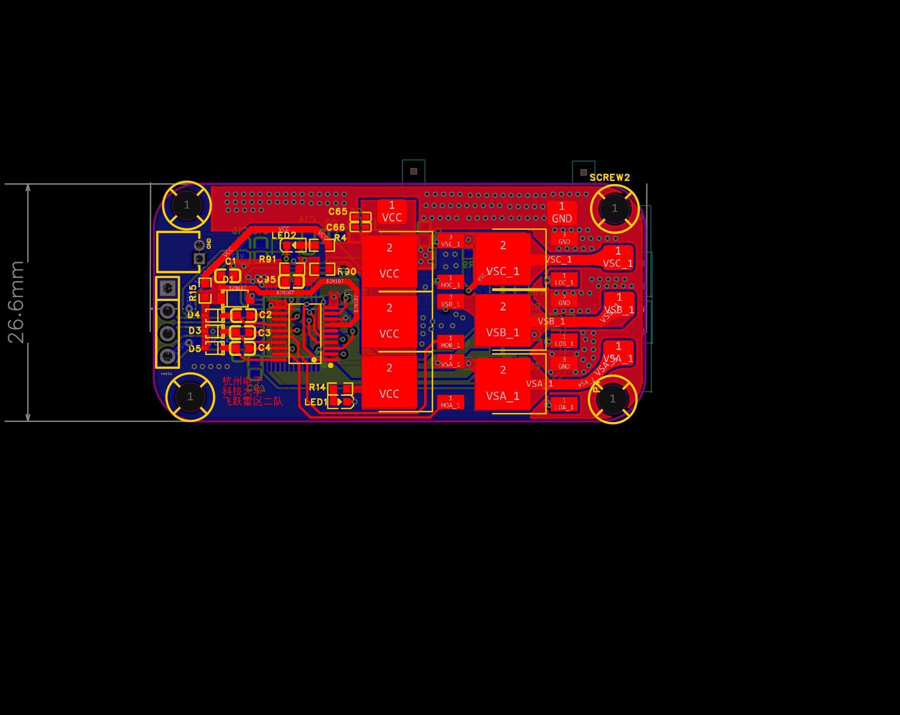
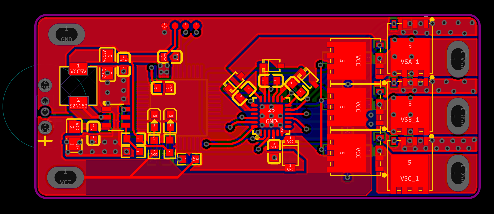
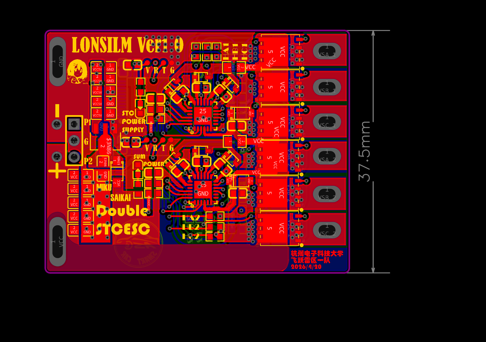
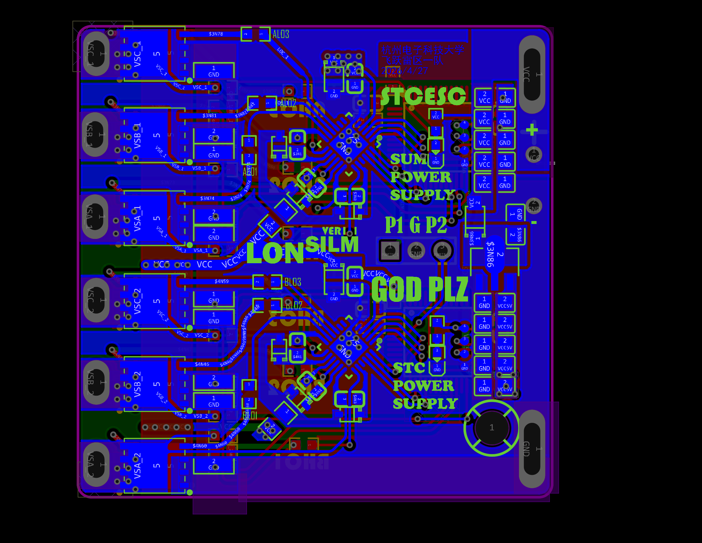
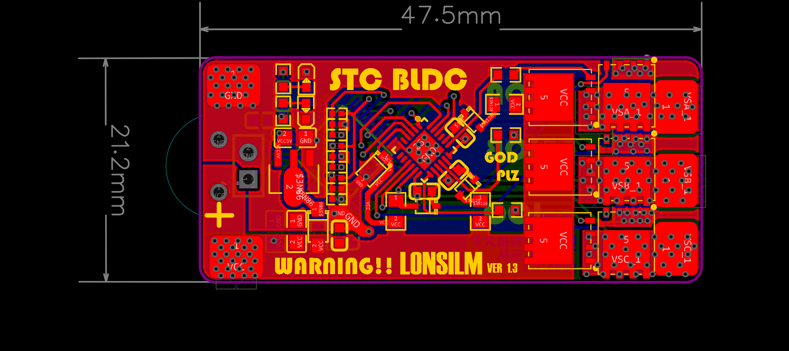
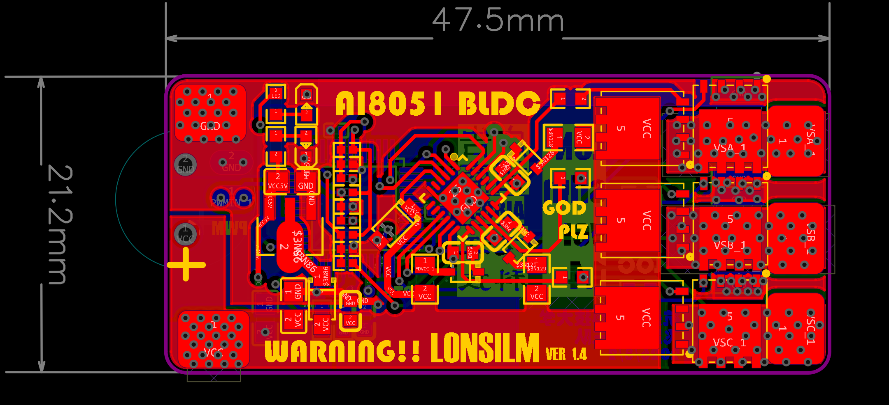

# 无刷电调（BrushlessESC）迭代记录

电调在这个项目中是相当重要的一环，然后我们最终站上国赛赛场的方案上有6块电调，而且对于飞跃雷区这个赛题电调也是极其重要的，在没有电调的情况下，电控队友想起飞都是一件难事

所以电调的迭代历程我会说的比较详细一点，布局布线，焊接测试流程我都会相较于其他板子写的详细的多

## 焊接测试流程

先讲一下板子的焊接测试流程

### 焊接顺序

一个电调板上可以视作主要有两块部分，一块是STC作为主控的信号部分，一块是预驱芯片控制六个MOS管的功率部分，如果对自己的焊接特别不自信的话，尽量不要一次性将所有的元件全部焊上去，这样在之后排查问题的时候很难排查

我的建议是先将主控STC及外围电路焊上去，等可以正常烧录固件，然后给预驱芯片信号的引脚能够正常输出方波信号后再继续进行功率部分的焊接

然后再将FD6288Q或者其他型号的预驱芯片及外围电路焊上去，然后可以给板子信号，用示波器抵在栅极电阻的位置看栅极波形，6路波形全都有的话，大概率除了过零检测电路外不存在虚焊问题了，

此时再将剩下的MOS管焊上，如果比较自信可以直接焊接电机，上电电机发出三声自检的声音大概率就没什么问题了，然后焊接上外挂电容，正常情况下给STC信号，无刷电机就可以正常的转起来了

### 自检异常排查

但是凡事总有例外，有的时候就是存在焊上MOS管上之后自检只响几声，我是觉得先可以按照多个现象进行区分

#### 情况1：自检异常、电流无突变（预驱虚焊）

用学生电源上电，自检只叫两或一声，然后电流并未出现突变的情况
此时大概率只是预驱芯片存在虚焊，加点助焊剂拿烙铁烫一下大概率就没什么问题了

#### 情况2：自检异常、电流突变（MOS管坏）

用学生电源上电，自检只叫两或一声，然后电流出现突变的情况，此时大概率是MOS管坏了，我当初从淘宝上买的拆机MOS管有的是坏的，焊上就有问题，想要具体查出是哪一块MOS管有问题又可以用分情况

**有热成像仪：**直接上电用热成像仪拍MOS管，大几率可以直接看到坏掉的MOS管有问题，然后我推荐是直接将这一相的两个MOS管全部换掉，因为大概率另一颗MOS管也是存在暗病的，等真正转起来的时候问题一般就藏不住了

有人会说了，热成像仪还是太吃经济了，有没有不吃经济的打法，有的兄弟有的，只需要每个实验室都有的万用表就好了

**第一步：断电、放电，确认板上没电再测。**

**第二步：先定位是哪个半桥（哪一相、高边还是低边）**

断电放电后，万用表打到二极管档或蜂鸣档。

先把红笔（正表笔）点电池正极，黑笔依次点三相输出 A、B、C。哪一相一碰就蜂鸣或者读数接近 0，说明这一相的高边 MOS 击穿了，再把黑笔接 GND（地），红笔依次点三相输出。哪一相通了，说明这一相的低边 MOS 击穿了，查完这两步，你就知道是"第几相、高边还是低边"——6 颗 MOS 里具体是哪一颗，就锁定了

**第三步：单颗确认（想拆下来测准）**

把怀疑那颗 MOS 拆下来，用二极管档单独测：

红笔接漏极，黑笔接源极，好 MOS 会显示 0.4 到 0.7V 的体二极管压降；如果显示 0 或者蜂鸣，就是 D-S 击穿了，反过来，黑笔接漏极、红笔接源极，好 MOS 应该显示 OL；如果也通了，同样是击穿。

最后测栅极：把表笔分别点在栅极和源极之间、以及栅极和漏极之间，好 MOS 都应该是OL，最多看到电容充放电的跳动读数；只要通了，就是栅极氧化层击穿。这样换一个新的MOS管就没什么问题了

这样，几乎上起码能够解决第2种情况

#### 情况3：自检通过但缺相丢步（过零检测虚焊）

三声自检通过，但是直接给信号之后发现电机无法正常转动，表现为缺相，丢步，大概率是过零检测的分压电阻和用于采样电压的STC引脚没有焊接好，用助焊膏和烙铁压一下大概率就好了

## 用示波器看波形

如果觉得直接把电机焊上去太危险，也可以不靠听电机自检的声音来猜故障，而是直接用示波器看波形。可以先在三相逆变桥的焊盘上看波形——无刷电调和有刷驱动不一样，看到的波形不是规整的方波，不过还是能分辨出明显的上升沿和下降沿。

关键要先分清看的是哪个点：

- **看栅极焊盘**：看到的是 PWM 方波，边沿上能看到米勒平台。如果上升沿很缓、米勒平台明显，大概率是栅极电阻选得过大，换小一档基本就好；如果下降沿也缓，可能加一个泄放电阻会好一点，不过之前也只是测试的时候有加过
- **看相输出焊盘**：看到的是 PWM 叠加换相台阶。如果下降沿有问题（拉不下来、变缓、异常），大概率是**高边 MOS 坏了**——高边击穿或被驱动卡住时，相电压被顶在电池电压上，低边拉不下去，下降沿就出问题；反过来，上升沿有问题则多半是高边拉不上去（高边开路或驱动没有输出

如果求稳妥的话，这样的焊接测试和修复流程大概率就能获得一个可以让无刷电机转动的电调了，如果还有问题记得去查一下原理图的错误，像是自举电容的电压很明显没有抬高，大概率就是原理图的问题

## 批量焊接

如果在验证完自己的电调是能用的时候就可以开始批量焊接了，就像这样

然后我觉得可能你能这样独立绘制，焊接一个单独的电调的话，其实四合一电调也没有那么难，只不过是后来发现四合一电调其实根本没什么说法，确实四合一更符合商业上fpv制作的逻辑，但是对于大部分打智能车的各位，坏了之后能快速修复，焊接之后能快速测试，不用特别压缩体积方便固定
的单体电调就足够了，虽然好的硬件设计大概率不会坏，但是像飞跃雷区这种飞控完全自己摸索去写的项目大概率会在调试过程中多次炸机，电调很可能因为电机被保护网之类的东西绞住，导致堵转，然后导致MOS管烧毁，不怕一万就怕万一，这也是我比赛这一年学到的经验

## 迭代经历

然后说完电调的焊接经验之后就是迭代经历了，这个电调上投入的精力确实要比飞跃雷区的其他板子投入的精力要多一些

首先是第一块板子，这块板子的选型当初受到了其他学长的影响，因此选择了比较好焊以及比较容易修的SOP封装，MOS管的选型也没有怎么了解过，用的就是初学那会儿做有刷的时的MOS管，在整个的布局布线上，也没有太多讲究，也就是知道自己回路要小一点，然后功率回路要短一点，但这些东西实际上只有在真的焊出实物以后让电机转起来才能得到真正的体会吧，这块板子反正地也分割的比较碎，然后像这些驱动回路也比较大，整体上学习的参考价值不大，而且还存在最大的问题就是和逐飞的固件对应的引脚是不一样的，导致直接烧录逐飞的固件是没有办法正常使用的，电控也没有时间去给专门改掉逐飞固件里的引脚
不过当初也是在测试和修复这块板子上花了很多时间，用示波器从相输出
一直测到栅极的每一路波形，最后在我重新画原理图的时候才意识到引脚连错线了，现在看来也不算白干

这个

