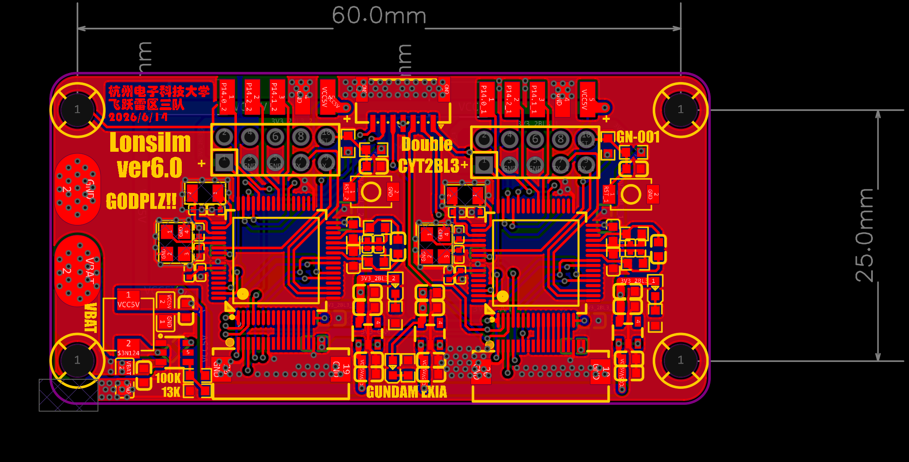
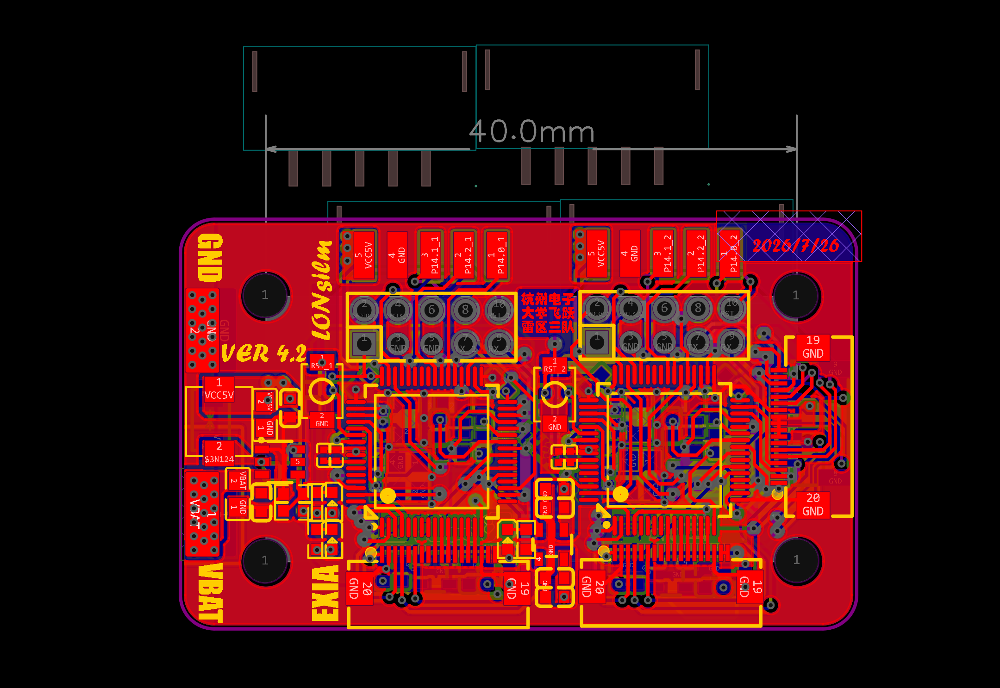
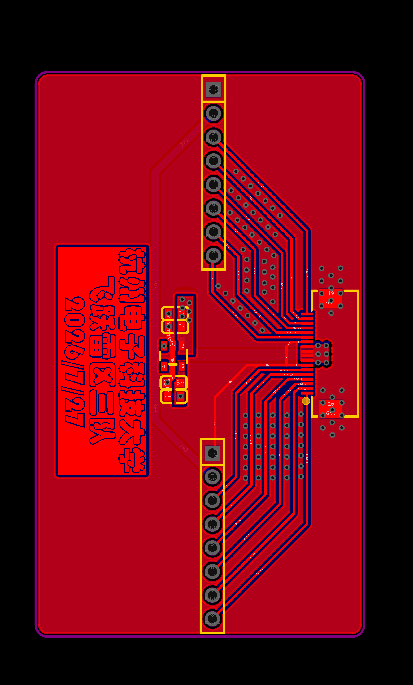

# 双 CYT2BL3 图像板（CYT2BL3_Image）迭代记录

## 方案背景

图像板是我们在意识到车板上去处理图像数据是一件漏洞很大的事，之后想了一个解决这个方法的雏形就是将CYT2BL3的板子做得更小做到飞机上，但是最后我推翻了这个想法，我是认为这样还是很复杂，因为他们还是在要求用三块CYT2去处理摄像头数据，之后再沟通与交流下终于是可以让飞机上的CYT4去处理一个摄像头的数据了，这样极大地提高了我画板的简易程度，两块CYT2作为图像板可以说是非常轻松，大小也能压到一个合理的范围里面去，不至于太过抽象，于是这款板子的方案就订下来了

## 供电方案

然后这个板子其实也没什么说法，简单的连几条信号线就好，然后供电部分是TPS54202实现从4s到5v的降压，然后再有就是每个MCU用一个RT9013降压，稳压后供电，摄像头的供电也是用一个单独的RT9013去供电

## 国赛迭代

之后进入国赛之后进一步压缩了板子的面积，然后由于飞机结构大小的限制发现WiFiSPI不能用，而且对于电控来说离线调试很麻烦，所以上面加了一个FPC接口用来将用来给SPI屏幕传数据的引脚引出到另一块板子上，这样子在没有离线的情况下也可以读取到原始图像，其他就没什么好说的了，国赛其实和省赛的方案几乎相同，只是为了缩小飞机体积才做了进一步的优化，没什么说法

## 总结

图像板从最开始「车板处理图像」的坑里跳出来，改成两块CYT2专心做图像板、飞机上的CYT4分担一个摄像头，供电也简单（TPS54202加RT9013），国赛基本没变，只是压缩了面积、加了个FPC接口方便离线看原始图像。
