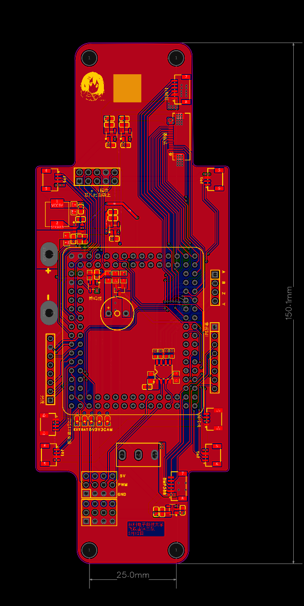
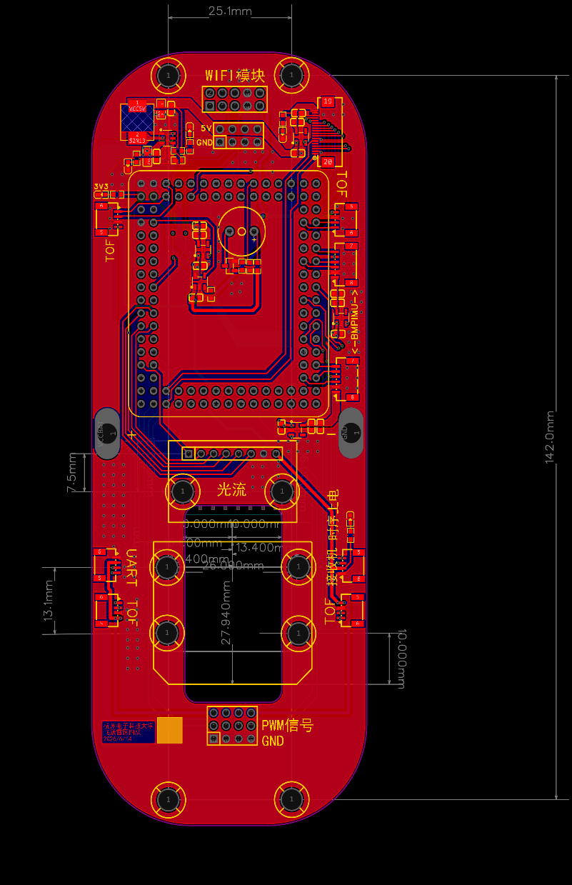
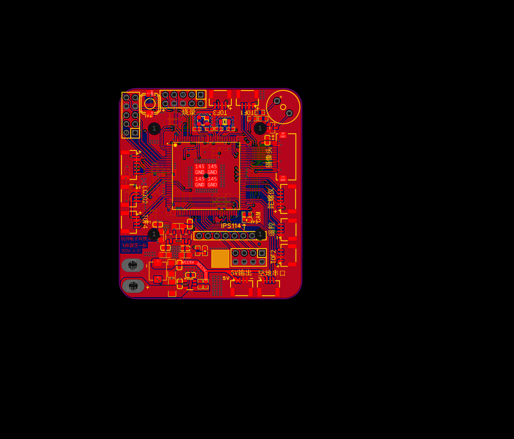
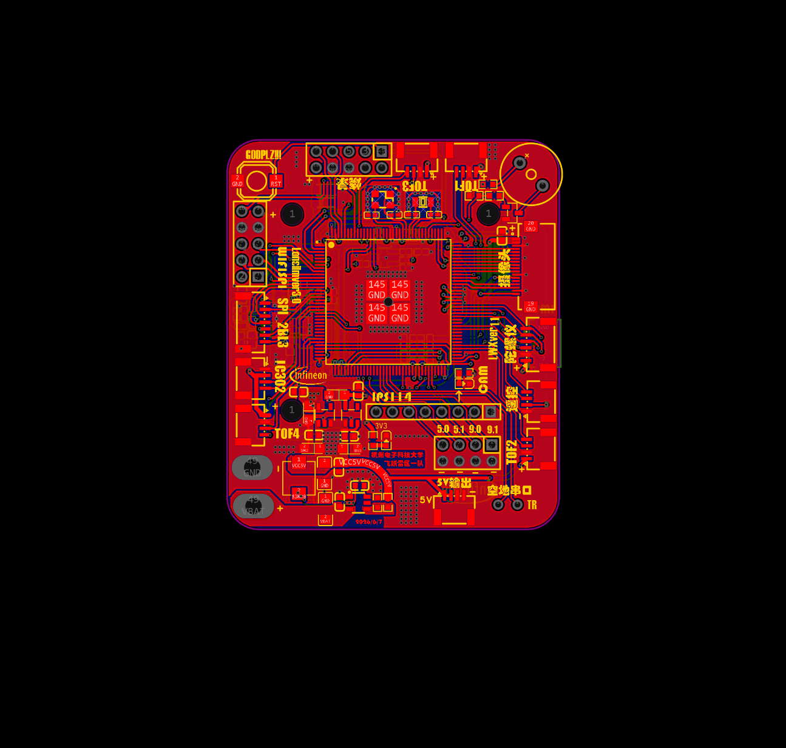
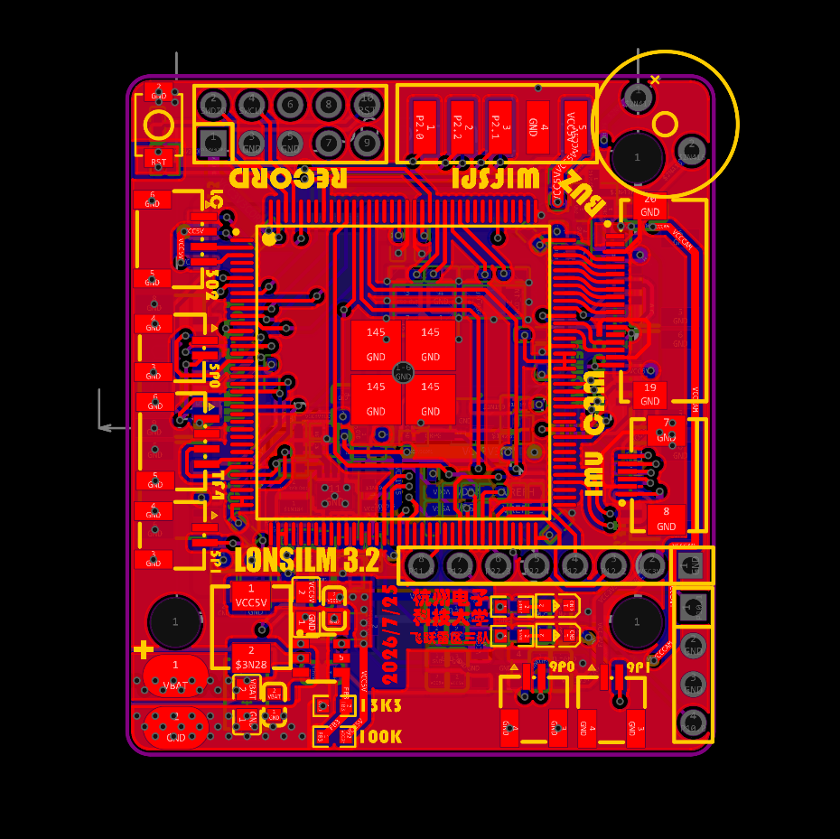
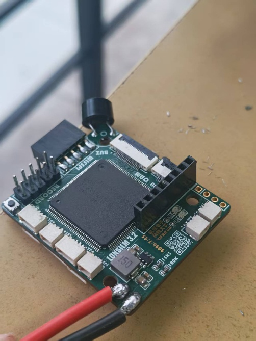
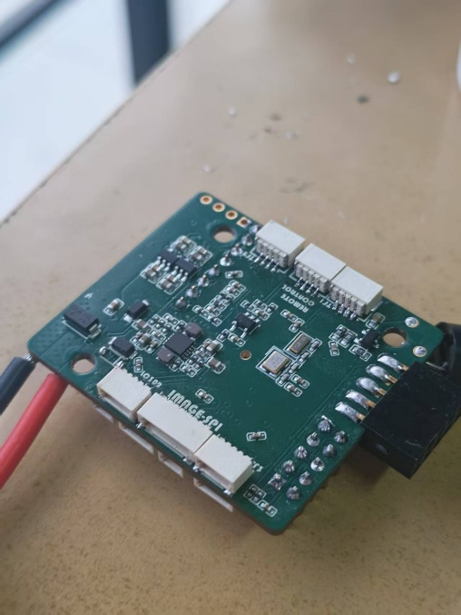

# 飞控板迭代记录

> 本文件由「纯人肉readme.docx」整理为 Markdown，内容为作者（硬件负责人）原始手写记录，仅做结构化排版与少量措辞整理，原意未改。

## 阅读提示

前两块飞控是初期尝试产品，板子为了匹配 Mark5 机架的固定孔位，导致板子面积巨大，在走线、布局等多方面没有学习价值。写在这里只是作为完整的迭代过程记录，不建议参考前两代的走线布局。

## 版本总览

| 版本 | 使用阶段 | 核心定位 / 关键变更                                   | 实物状态 |
| ---- | -------- | ----------------------------------------------------- | -------- |
| V1   | 初版     | 逐飞核心板引脚引出转接板                              | 已丢失   |
| V2   | 迭代     | 兼作光流/摄像头固定板，电源线居中，去开关             | 已丢失   |
| V3   | 迭代     | 首次直接使用 CYT4 芯片，30.5×30.5 标准孔位，删气压计 | ——     |
| V4   | 省赛     | 修 reset 键、接口调整、加 FPC 陀螺仪接口              | 在用     |
| V5   | 国赛     | 38×44mm 小型化、6 层板                               | 在用     |

---

## 第一代（V1）

这是我加入队伍后画的第一块飞控板。

本质上就是一块「逐飞核心板引脚引出转接板」：把逐飞核心板上有必要用到的引脚引出来使用。

- **电源管理**：很简单，只用 TPS54202（4S → 5V）和 RT9013（→ 3.3V）。
- **引出的外设**：
  - 4 路 ToF（对应 4 个串口）
  - 接收机（1 个串口）
  - ICM42688 陀螺仪
  - BMP388 气压计
  - 光流
  - 摄像头
  - 开关
  - 电调信号
  - RS485（前代遗留，刚入队时听说能用，后来发现原理图有错误；之后没有深究，直接弃用）
  - WiFi SPI

整体相当简单基础，没什么难度，但作为第一次画板，积累了不少经验。

（古早产物，实物已丢失）

## 第二代（V2）

电控在用完第一块后提了迭代建议，我熬夜赶制的。相对而言没有大改动：

- 直接用这块板子当作光流和摄像头的固定板；
- 电源线移到板子中央两端，一定程度让飞机两端受力更均衡；
- 省去开关；
- 其余外设与 V1 相同。

（古早产物，实物已丢失）

## 第三代（V3）

第一次直接使用 CYT4 芯片（不再用逐飞核心板），相对前两次是一次非常大的提升。

- 孔位改为常用的 30.5 × 30.5 mm，适配大部分机架；
- CYT4 的供电完全采用逐飞方案：**双路同步降压 DCDC（U3）**，从 5V 生成两路电源——第 1 路 VCC3V3CORD=3.3V（给 VDDD/VDDA/VDDIO），第 2 路 VCC1V15=1.15V（给 VCCD 内核），两路电感均 2.2μH；
- 其余供电方案沿用第一、二代；
- 外设上删掉 BMP388 气压计——电控认为室内环境下该传感器数据不够精准，不如只用 ToF 定高。(张跃哲: 硬件队友用于描述传感器的语言过于外行 , bmp388的高度融合存在的问题来自于以下几个方面 , 一个是比赛要求只有0~1.5米高度,气压计因为高度变化产生的数据变化远远不如密封效果或者说桨叶产生的风力的影响 另外是延迟和噪声都远远大于tof和imu)

## 第四代（V4）

布局上略有优化：

- **修 Reset 键**：之前的 reset 键只要插上烧录器就一直被按下，无法插到底，非常难用，调整了位置（本质是烧录器与按键的机械干涉；实际使用中烧录器斜着插也能勉强烧录）；
- **删掉 PMW3901**，替换为一个 7P 的 SH1.0 接口，用于与机架下方的三摄板 SPI 通信；
- **加 6P FPC 接口**：给自制 FPC 陀螺仪 ICM42688P 供电和通信；
- **空地串口改成焊盘**：方便拆装串口线缆；
- 优化丝印；
- 其余外设和供电无大变化。

这是省赛赛场用的飞控。

## 第五代（V5）

进入国赛才开始画。供电方案与外设和第四代完全一致，大的调整是小型化和叠层优化：

- 板子面积从 50 × 60 mm 优化到 38 × 44 mm；
- 优化 CYT4 供电部分的走线；
- 使用 6 层板：
  - 顶层 / 底层：器件层
  - 内层 2：信号层
  - 内层 3：功率层
  - ⚠️ 内层 3 功率层：功率平面做的一般，全用的较粗走线而不是铺铜平面，回流与过流能力都一般；正确做法是功率层直接大面积铺铜。这部分不建议作为学习对象，确实有很大优化空间；
- 删掉大部分不需要的外设接口。

这是国赛赛场用的飞控。

## 实物照片

## 踩坑汇总

| # | 坑                   | 现象                                    | 处理 / 教训                                              |
| - | -------------------- | --------------------------------------- | -------------------------------------------------------- |
| 1 | RS485 前代遗留错误   | 原理图有错，听说能用实际有问题          | 未深究，直接弃用；接手旧设计要先验证再沿用               |
| 2 | Reset 键机械干涉     | 插上烧录器就把 reset 键压住，无法插到底 | 调整按键位置；本质是「器件布局要考虑调试工具的机械空间」 |
| 3 | BMP388 气压计白装    | 室内数据不精准，用不上                  | 删掉，只留 ToF 定高；选传感器先确认使用场景              |
| 4 | 功率层用走线不用铺铜 | 功率平面回流/过流能力一般               | 功率层应直接大面积铺铜，而非粗走线                       |

## 总结

飞控板相对而言没什么特别的难度。总的来说，飞控硬件的迭代更多只是方便结构上的优化，同时对电控的调试也会方便很多。

所以我认为：智能车的硬件其实应该在「电控的人机交互」上多下一点功夫。

---

## 待办 / 待补充

- [ ] 各电源轨电流能力——作者未测量，暂缓
- [ ] 确认两张实物照片（fc-photo-1 / fc-photo-2）分别对应哪一版
- [ ] 双路 DCDC（U3）具体型号——逐飞核心板方案，待确认芯片型号

[返回硬件 PCB 总文档](../README.md) · [返回总仓库 README](../../README.md)
