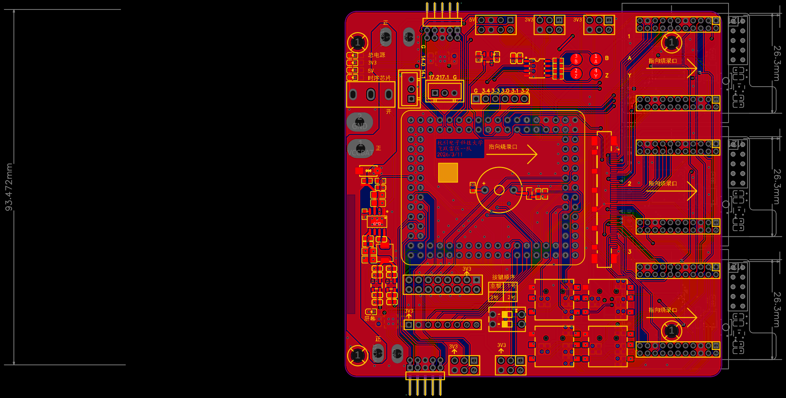
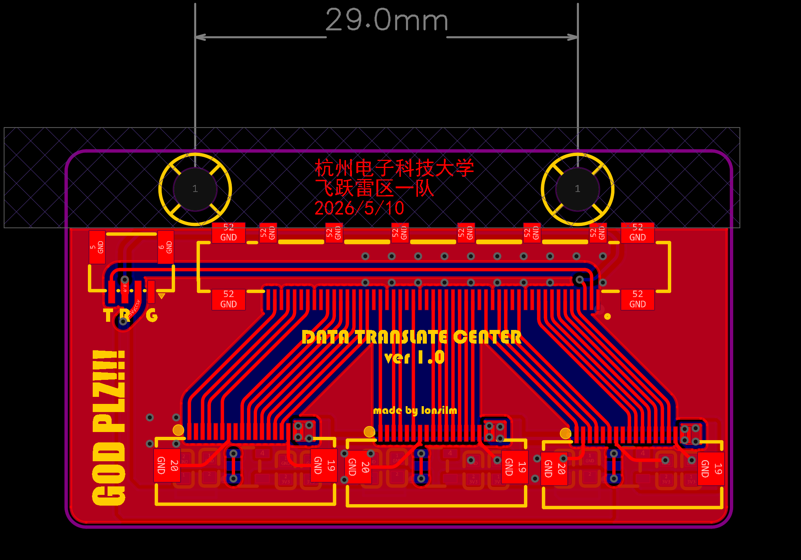
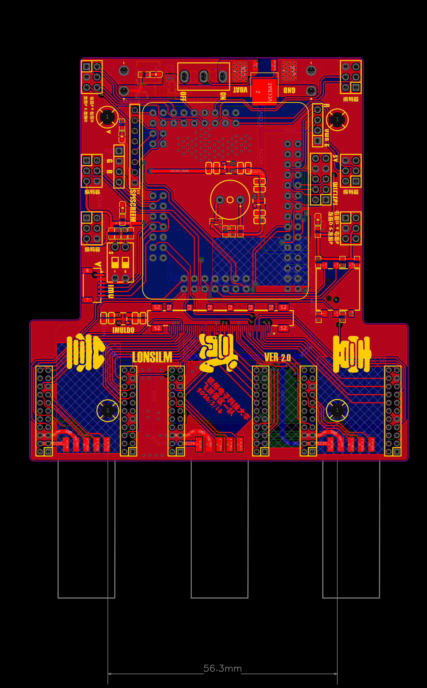
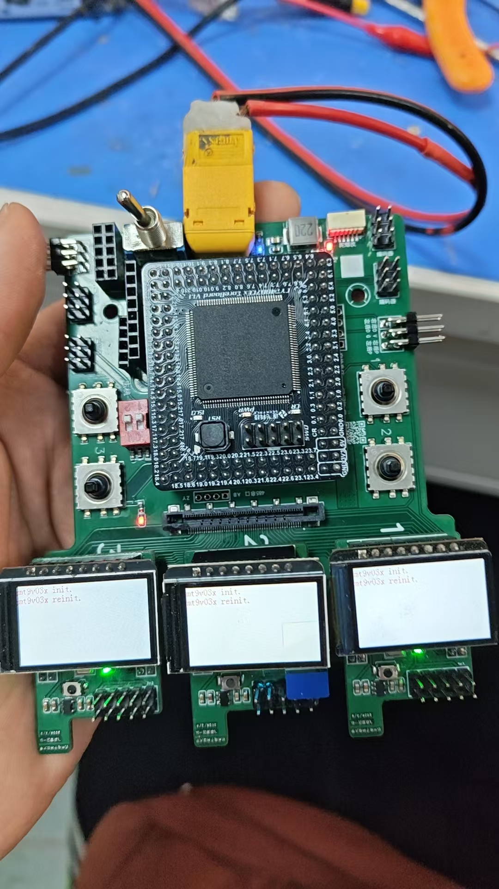
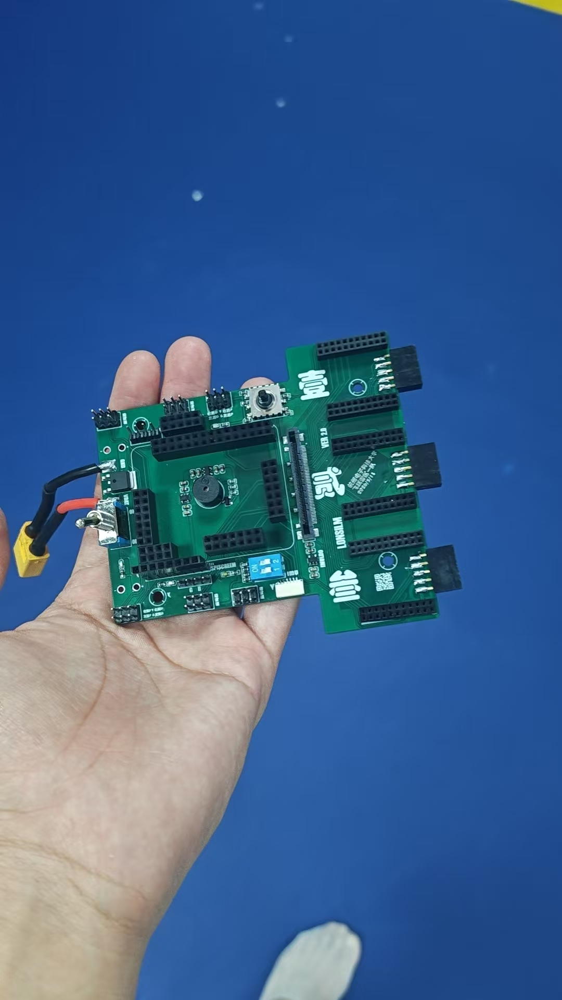
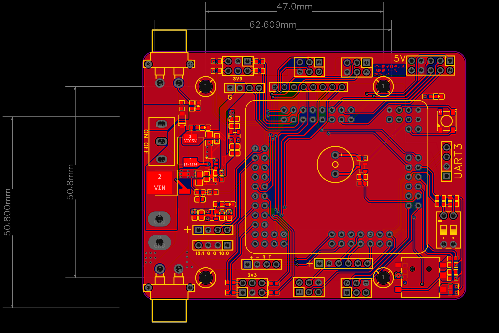
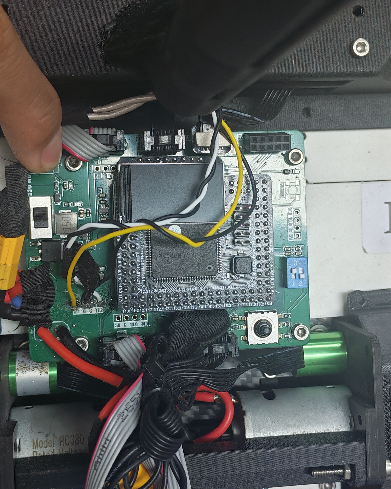
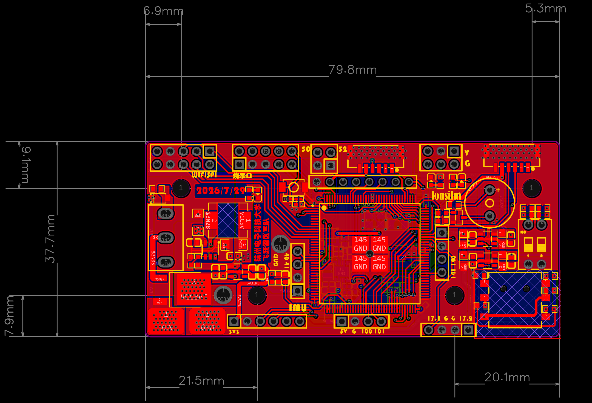
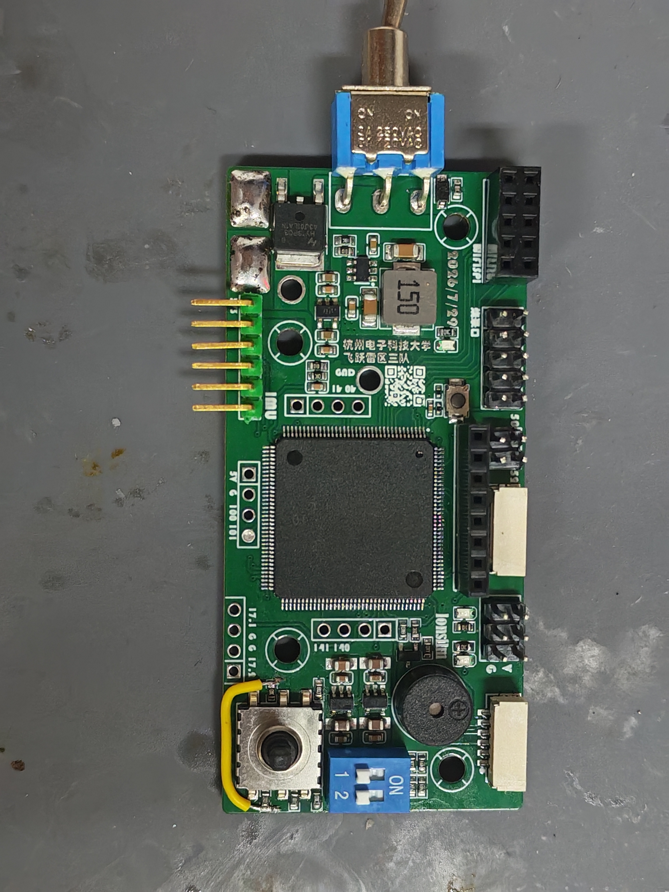

# 车控板（CYT4bb7_Car）迭代记录

注意，前面两版的车板参考价值有限，整体的方案是存在很大的问题，我也不会去投入过多的笔墨去描写这两次的板子

## 三摄方案

首先是刚开始的第一版的车板，先说明一下我们这个时候的三摄方案，首先，我们的摄像头是挂在飞机上的，然后我们也是知道中间肯定会有一个车与飞机的线缆，于是我们想了一个现在看来不够成熟的方案，因为初期还是使用的M车方案，然后很明显飞机上的雷霆大板导致飞机结构上没什么可以放置什么板子，而M车上的面积足够大，所以我们先是设计了一块较小的CYT2BL3的核心板

然后再车的板子上设计了三个插槽，分别处理飞机上的三个摄像头数据，然后这是第一版的雏形，这块板子是我进入团队之前由前任硬件负责人设计的，整体方案不算成熟，这里不做过多评价，下面是这块板子的PCB图

第二版是我接手之后做的一部分优化后的结果，但是由于这个方案本身存在就存在一定的问题，所以我不打算在这个方案的车板上投入过多的描述

但是还是提一嘴，在这个方案上我迭代了不止一版，说是一版是因为实际上的功能没什么大的变化还有就是也不好用，主要都是在人机交互上下功夫，但是现在看来只能说时间投入与收获不成正比

在进行这块板子的描述之前我还是想先吐槽一番，这块板子的问题在于缺少对方案整体的统筹规划，导致在错误方向上投入了不少时间，不过造成这一切的有多方面的因素，在这方面就不多做过多阐释

就是很明显就能看到的一个51pin的超级大插口，然后这个插口是将三块摄像头的所有引脚直接引到车控上，然后再发送给车上的CYT2的板子，于是中间还需要一块板子用于实现将三块摄像头的所有线全部引到这种适配这种接口的线缆上

这块板子还要固定到飞机上，但其实这块板子都迭代了三次，但是如果我描述的再详细一点，这个迭代记录将变成我独自一人对这个项目的全篇否定，这个方案再刚造出来雏形就因为多方原因被否掉了，包括的原因有由于引脚过多极容易存在虚焊连锡，而且甚至真有问题都不知道是车上的接口焊接有问题，还是转接板上的接口焊接有问题，数据受干扰也很严重，甚至每次reset后获得的图像都是不一样的，还有就是线缆太重了，电控调试的难度极大，在随后与队友的交流中换了方案，下面是第二块板子

这是这块板子的实物图，上车图太早了，不方便找到

## 第三版（校赛）

然后就是第三版，实际上第三版和第二版是并行画出来的，在这一板实际的原型是为了校赛车能完赛临时画的一块板子，校赛完赛当初想的就是单摄能完赛就算不错了，所以上面的功能也是就是简单的核心板引出来接口，像是车机串口，驱动的2x3接口，然后还有驱动的接口，还有接收机用的的串口，当时规则说可以使用UWB，当时在上面也有很多的尝试，也有做过为了UWB的安装方便做了板子上的结构优化

所以说是一版但是实际上也是有2~3版的迭代的，但是其实大部分的接口都没有什么明显的变化，之后有过调整也是布局上稍微改了一下，我说其实这所谓的也不是硬件工作的难点

从丝印上也能看出来这个板子的外观细节相对一般，但是主要的功能都是完善的，然后还加了一个WS2812用作状态灯，然后就是引出了两个可以用开关控制的供电接口用来给两个双路驱动和灯板供电，之后还有迭代就是加大了焊盘的大小，方便焊接给飞机供电的线缆，不过这个整体的布局还是存在着较大的问题，之后在想出图像板之后就稍微优化了布局就直接将这块板子用到到省赛上去了

下面是装车的实物图

## 国赛板（F车）

然后进入国赛之后，这个车模换成了F车，发现几乎没有什么地方能够固定车的板子，之前内块板子不能继续用来当作F车上的板子之后才将这个板子的绘制拉上了日程，然后这块板子也就是相当于把飞控上我压缩过后的供电直接照搬下来，然后把原本车板上的接口誊到了这块板子上，都是CYT4作为主控的话，主控芯片的供电电路的话其实这些东西都不是特别需要另外去学，只要有一个模块是能用的然后就是像拼积木一样去将这些个模块混着搭来搭去就好了，这种模块集成的能力其实是智能车这种不算特别吃硬件的竞赛中硬件应该发挥出来的能力

特别优化的点我说一下，像是这个开关是放在了板子的右侧，符合大部分右撇子的操作习惯，然后就是车机串口线是放在了板子的下侧，这样做的时候我其实有考虑方便供电线和信号线统一的拆装的，但是最后这个结构没怎么考虑这些，相当与是直接沿用了M车的车机线延申方案，这些硬件上的巧思也就只剩下焊接优势了，没有快速拆卸的优势了

同时也优化了接口，就是将之前逐飞旧的编码器接口换成了新的去适配逐飞现在新的编码器接口

这块板子上有一个小bug就是五向开关的左侧没有接3.3V，之用的时候需要用导线短接一下，还有更简单的方法就是直接在我板子上的工程文件将我左侧的开关原理图稍微修改一下就好

还有就是这个WiFiSPI只能弯插，但是弯插会挡到开关，解决方法就是焊接一个弯插的开关

这是实物图

## 总结

车控板从三摄方案被否掉后，又画了第三版校赛应急板，最后到国赛才定下来——把飞控的供电模块直接搬过来、把原车板接口誊上去，做成模块化拼接的一块板，这也是后面一直用的那版。