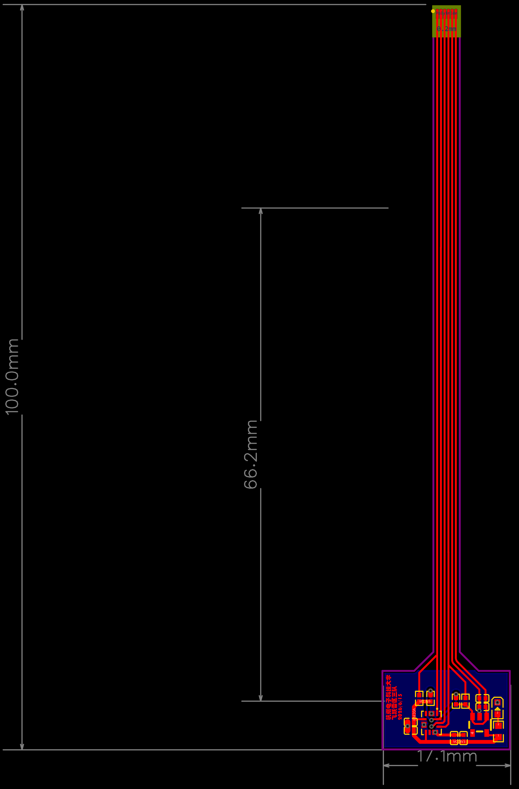

# FPC 陀螺仪（FPC-Gyro）迭代记录

这块板子说白了就是把一颗 ICM42688 陀螺仪做在柔性电路板（FPC）上。

## 为什么非要用 FPC

陀螺仪最怕的是电机和桨叶传上来的高频机械振动。

普通 FR-4 硬板是硬连接，振动直接传到芯片上；而 FPC 是软的，中间相当于加了一层柔性缓冲，高频振动在传到 ICM42688 之前就被衰减掉一大截，FPC 这个制版材料本身就是一个低通滤波器

当时换 FPC 的同时也改了固定方式，所以严格来说是「FPC + 新安装方案」这个整体比旧的 FR-4 方案好，不能把功劳全算在 FPC 材料头上。

竖直方向（Z 轴）改善有限，那部分的振动还是得靠结构减震和软件滤波去兜。

## 总结

FPC 陀螺仪说白了就是靠柔性板减振，把电机传上来的高频振动压下去，让IMU数据干净很多；不过竖直方向改善有限，还是得靠结构减震和软件滤波兜底。