# 忆往昔

> 这篇文档不属于任何技术阅读路线 , 也不教任何东西。它只是我的回忆录 , 收留这一路走过来的风和雨。哪天忘了自己为什么出发 , 就回来翻一翻。

## 起点

我了解到智能车比赛 , 是在班助带着全班去四教参观曾经的智能车遗址的时候。那个时候四教的ASC实验室里几乎都是满地的快递盒 , 蓝布也没多少了 , 因为那个时候正在搬家 , 逐渐从4教搬到西北田径场的"阴暗"的地下室里面了

班助跟我说他是智能车国一 , 然后给了一个招新群的二维码 , 后面我就进群了

后面了解到班助是创意的 , 水水就随便拿国一甚至国冠的 , 也没有任何校内竞争 , 是保研爽爽加分的人的必选

群里分 电控 , 硬件 , 视觉。

那个时候的电控先学51单片机 , 然后是stm32 , 学一些姿态解算什么的 , 主要还是以资料为学习路线

硬件我感觉第一学期没学啥 , 就是学电阻电容 , 认识一些元器件 , 用ai画了最小系统板吧

视觉也不是智能车这里那种底层跑在openmv上的视觉 , 而是跑在电脑上的、高级一点的视觉

那个时候一开始招新用的是QQ群 , 我很积极 , 一天到晚在群里聊天 , 和很多未曾见面但是名字很熟悉的学长聊天 , 也是在一步步的聊天当中更加了解了智能车

  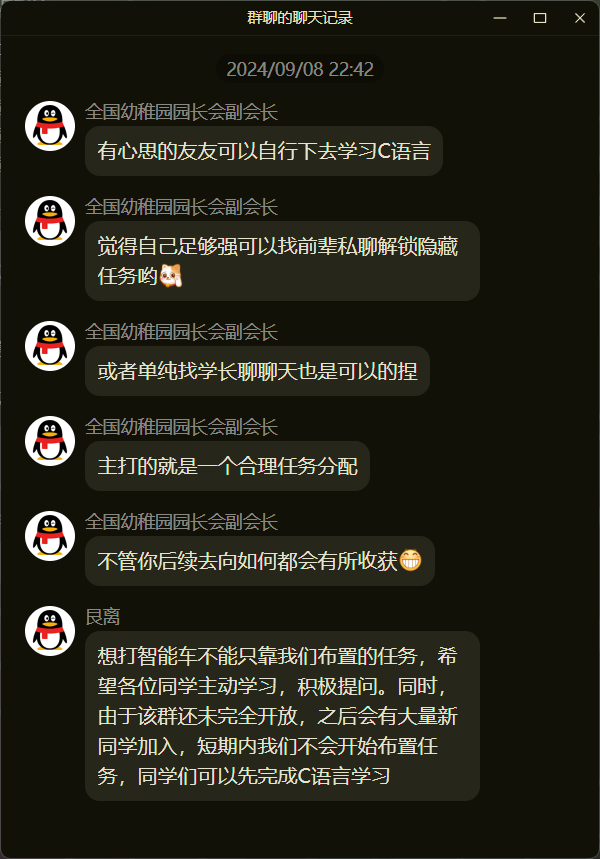
  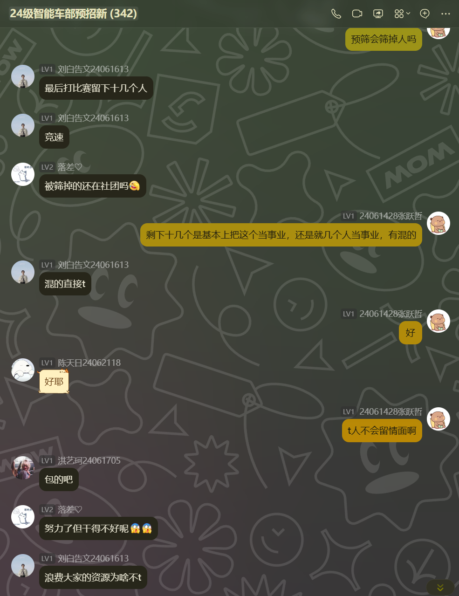

  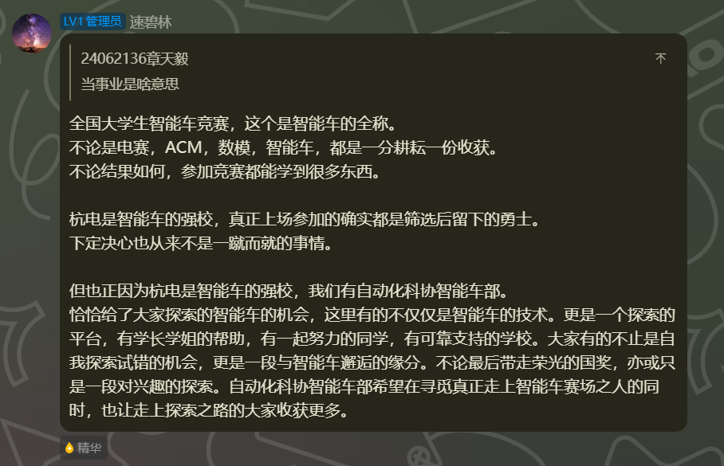

那个时候C语言的学习,是借用其他社团的OJ平台,然后我一看这不就是hydro的项目吗。[Hydro](https://github.com/hydro-dev/Hydro)

然后刚好我高中同学就是这个项目最主要的开发者,然后我就觉得很神奇,因为之前确实没见到身边的人部署这个项目,只是他自己开的主站我知道很多人在用,然后看到我来了杭电之后,居然身边就有人自己部署了这个项目,就在群里问了,结果就被一个非智能车的学长怼了,后面也挺无语和害怕的(害怕就此和智能车说再见了)

  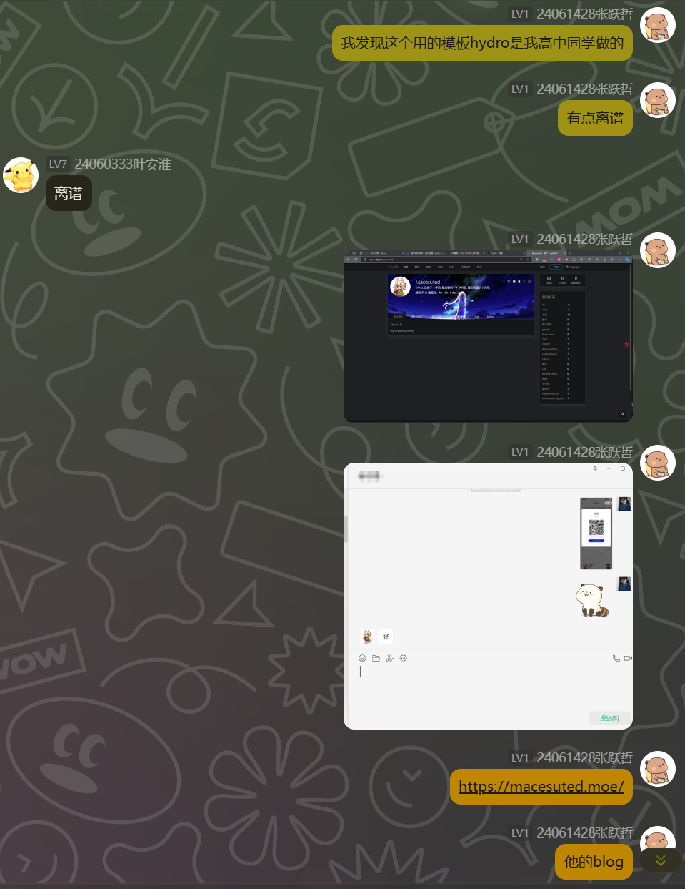
  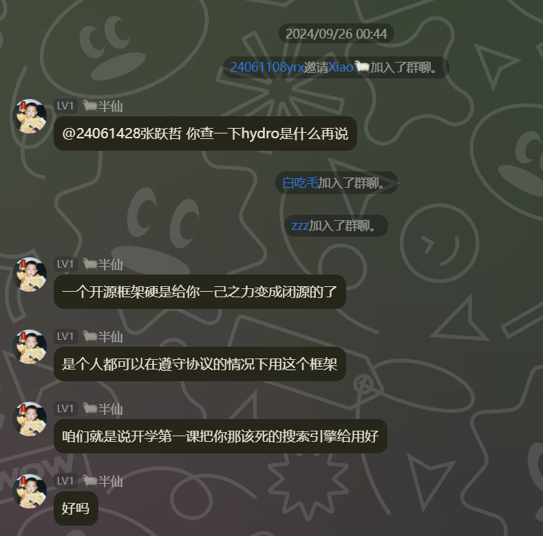

  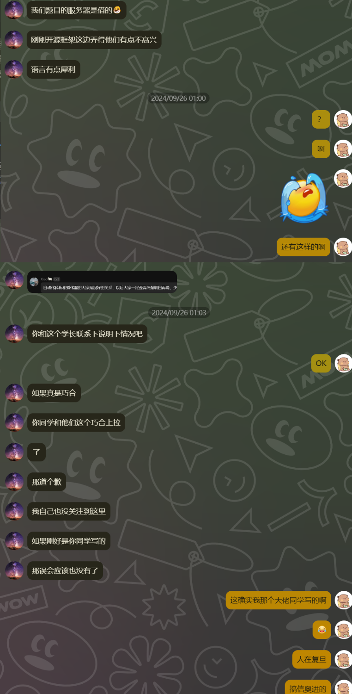

后面了解到 智能车 这里没人会部署hydro , 然后是借用其他实验室的网站来发布题目的 , 然后可能是我的学长和他们沟通本身存在问题 , 我记得是误删了他们的题目 , 后面我在群里就成了导火索

也许这件事情 , 在看热闹的大部分人眼里就是 : 一个蠢蛋啥也不懂开源就瞎几把乱说 , 导致两个社团有点矛盾。但我自己知道自己没这个意思 , 这个也成为我相当一段时间内的心结。甚至于后面我成为别人眼里的学长的时候 , 我也要自己部署属于我们实验室自己的OJ , 然后花费很多时间设计自己实验室的C语言考核题 , 虽然很麻烦 , 但我想是我自己在解决 那个时候"寄人篱下""有求于人"的内心的病根

我部署的hydro项目在 [oj.hduasta.cn](https://oj.hduasta.cn/) , 在25届的招新中出题200余道 , 参与人数300+ , 服务器应该今年10月份过期,后面再看域名和服务器咋迁移吧

后面我几乎就不怎么在群里说话了 , 而是一直和苏学长进行交流和沟通 , 汇报每天的学习进度。

  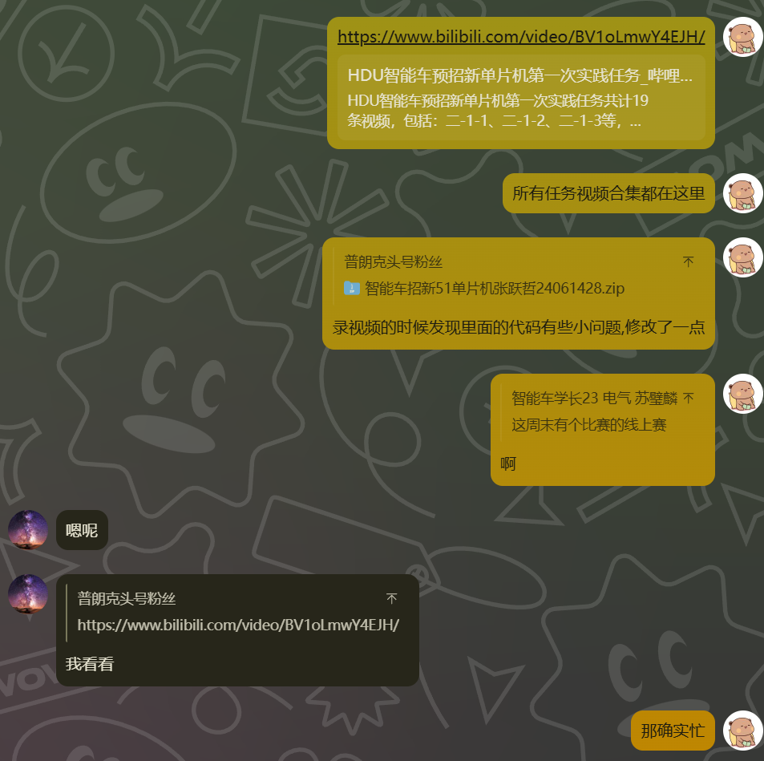
  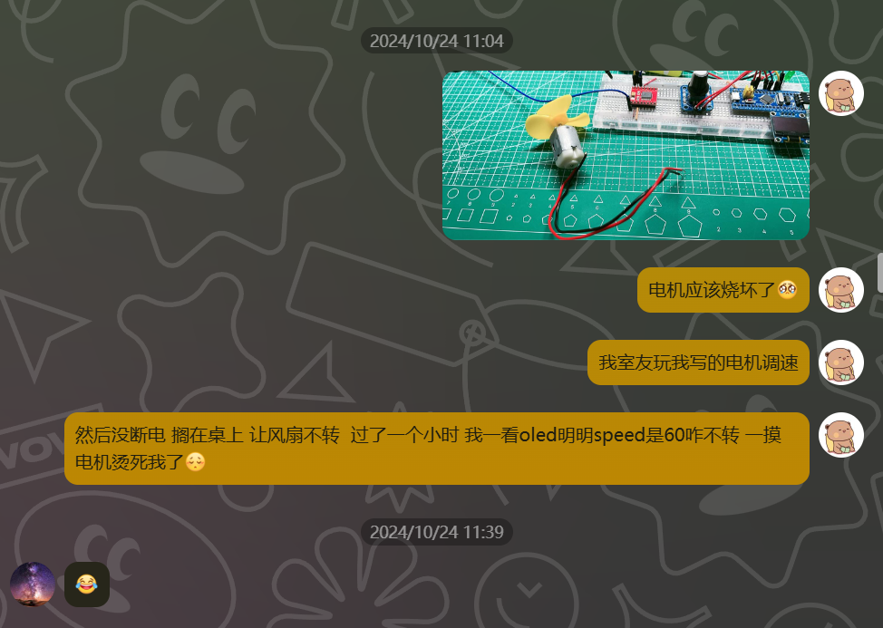

苏学长算是我学习 51单片机和32单片机的引路人 , 虽然他是硬件 , 但对于系统架构的分析和软件的熟悉 , 让我一直以为所有的硬件都是像他这样综合素质优秀的硬件。

很感激苏学长 , 虽然第20届比赛他因为龙芯赛道是板卡弃赛了 , 但他在我调试NXP_CCD车模的时候 , 给出了宝贵的轮胎保养和重心的建议

如果没有苏学长 , 也许那天我在群里遭到其他社团大三学长那次我认为是无端的指责 , 我就离开智能车的招新了 , 也许就不再学习嵌入式了

虽然他后面离开了智能车加入了创意机器人部 , 我们智能车的招新到底好不好 , 集训效果到底怎么样 其实对他的身份来说是无所谓的 ,也不是他的责任 , 连我们实验室自己的硬件学长都没担起这个责任 , 更谈何他早早的离开了智能车呢 , 在我这一届 硬件的暑假集训(2025年7~8月)当中 , 他仍然挺身而出 , 帮助我们ASC实验室顺利完成 硬件的传承和指导工作 [相关推送 1](https://mp.weixin.qq.com/s/jEN4bamzFyMHyRfn4FI6iw) , [相关推送 2](https://mp.weixin.qq.com/s/Hz0UB0PGbe3hXBOEb7fXoQ)

  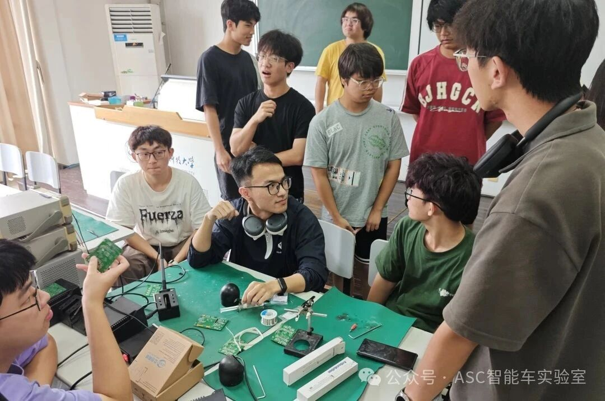

图片当中的C位就是苏学长

大一我学习单片机 , 还是算一步一个脚印很扎实的 , 从51单片机的 [51Ptactice 仓库](https://github.com/ZhangStudyLife/51Ptactice) 开始 , 基本上9月底就把外设该学的都学完了

后面开始学习 f103单片机 , 还是跟着江协的课程

后面就开始联系专业的电控学长 , 江秉臻。

我在11月份开始 , 12月开始打算自己做一辆平衡车 , 网上平衡车现成买的很多 , 到手既可以提供源码 , 就可以实现遥控平衡车 , 包括那个时候很多其他社团厉害的 , 都传言已经搓出了平衡车 , 但我始终在纠结 : 买成品到手就可以用 , 那能叫真的会吗? 所以我最后还是选择了从0开始搓。

我选择了那种减速有刷自带编码器的电机 , 然后自己设计底板,刚开始是使用stm32入门的面包板 , 加上各种杜邦线和胶水 , 糊起来的一辆车

当初对于硬件我是一窍不通的 , 对于这个有刷电机的供电我也是一头雾水,网上找资料也找不到,后面我开始了解各种电池接口,然后对于dcdc降压电路我也不是很懂,只能淘宝买各种模块,然后差不多搓出来了第一辆车 , 很快就因为杜邦线等问题就烧毁了,可以查看视频

[【手抖全烧坏了】](https://www.bilibili.com/video/BV15rqAYAEJZ/)

[【车抖的离谱！手都松不了】](https://www.bilibili.com/video/BV1yhBPYQEni/)

[【我的平衡小车终于能立起来了！】](https://www.bilibili.com/video/BV1tjkmYdETt/)

也算是一段奇妙的经历了 , 为了解决杜邦线和面包板的问题 , 自己开始初学嘉立创 , 当初连铺铜是啥都不知道 , 只是把pcb当作一个方便的接插件 , 但是所幸还能用

然后对于平衡车的结构就是自己学sw, 然后导出dwg发给 切割亚克力的淘宝商家做

后面大一的寒假(2025年1月), 我在家里就开始学习cubemx+hal 使用的板子是野火开发板 , 在这一块板子上面 , 我接触了更多的引脚 , 然后入门学习了SD卡的SPI通信 以及移植 FATFS文件操作系统 , 并坚持发视频 [【CubeMX_HAL_野火指南板学习过程】](https://www.bilibili.com/video/BV1TWwTetEAf/?p=2)

[【重生之我是OLED小黑子】](https://www.bilibili.com/video/BV1f9AYedEej/)

后面因为态度积极 , 学长 @江秉臻 @张旭望 —— 也就是我们实验室去年唯一的顶梁柱队伍 —— 联系实验室指导老师给我提供了打 NXP 平衡竞速组的机会。

## 第一个赛季 : NXP 平衡竞速组

那一整个学期的备赛下来 , 遇到了校赛的挫折 , 省赛的释然 , 很感激学长能给我打比赛的机会。那个时候备战了3个月 , 真的花费了很多心思 , 使用mpy开发也出了不少问题 , 爆内存等

平衡车方面的经验也很少 , 甚至一直都是正跑的 , 对于圆环的处理压根没想到使用openart , 都是一直使用 双ccd 企图把圆环写好 , 但是还是太难了

具体的视频可以查看 [这里](https://www.bilibili.com/video/BV1rRQrB7EW6/)

先得补充一下我们学校实验室的背景资料

分为3个实验室

一个是ASC也就是我所在的 Automated Smart Car 自动化智能车 , 打得比较多的组别是信标 , 还有创意(实际上两地相隔比较割裂,我们和创意都不太搭嘎的,但名义上是一起的)

一个是光电实验室 , 是隶属电子信息学院的 , 往年的PVC统治实力都是他们的

一个是电磁实验室 , 也是隶属电子信息学院的 , 往年的所有电磁组都是他们必打的

然后按照当年的情况 , 我们实验室是属于竞速方面完败的 , 包括其实我3月份进入实验室就知道隔壁实验室这个事情了 , 既来之则安之

校赛结束 , 隔壁实验室的学长邀请我加入他们队伍 , 可能是他们队伍缺人,可能是觉得我算努力

但是还是被我拒绝了 , 虽然那个时候硬件队友画的板子还是会莫名其妙死机

但是一个是我和队友既然已经组队了 , 另外一个是自动化的学长给了我打比赛的机会 (大一竞速只有我nxp一队,除去创意乌泱泱的一群杂牌军) 对我有知遇之恩 , 我"叛逃"到隔壁实验室就是不仁不义的行为

  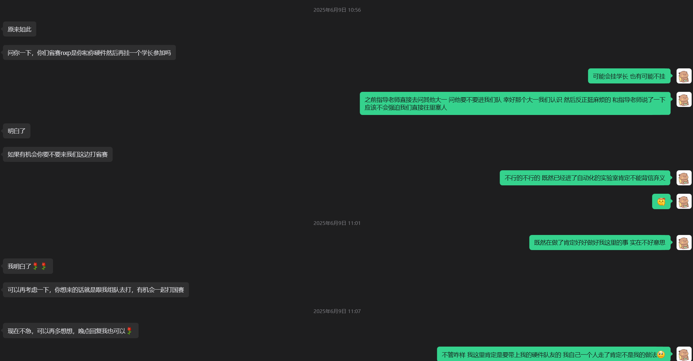

  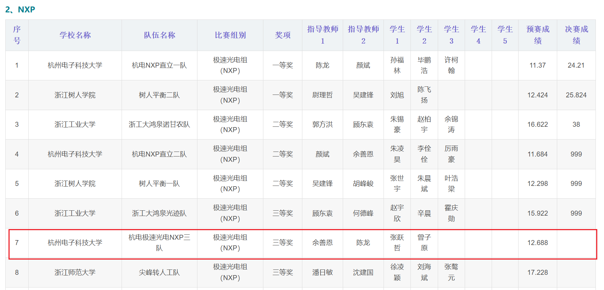

  

那个时候我就明白了 , 智能车不相信眼泪 , 输了就是输了。

竞争组别（同校一共有 3 个实验室 , 如果有组别冲突就是生死局 , 因为赛制关系就是只能活一队进入国赛 , 另外一队哪怕放在全国再强也是省三）就是这么残酷 , 所有人只会知道进国赛的那队很强

## 实验室振兴

着手开始部署实验室自己的OJ , [oj.hduasta.cn](https://oj.hduasta.cn/)

暑假集训开始正式搞 , 用飞书组织规范报销流程。具体可以查看我们24届的暑假集训总文档 [飞书文档](https://hdusmartcar.feishu.cn/wiki/BVT4wtMaki7kKFkxKQ4cgNZlnLf)

以及25级招新的文档 , 我甚至觉得里面为招新整理的电控学习资料 , 适合大部分人重新读一遍。当初写这套资料的时候 , 我花费的心思不比这个开源项目里的任何一篇文档少 : [25级招新文档](https://hdusmartcar.feishu.cn/wiki/KUlPwf6GKiO6zxkxxxcc7rzenJe)

  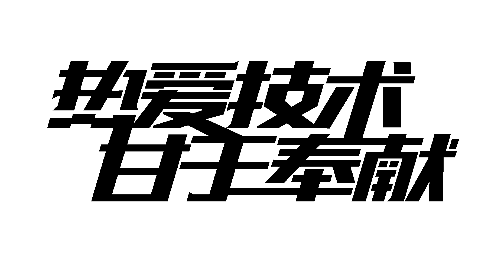

  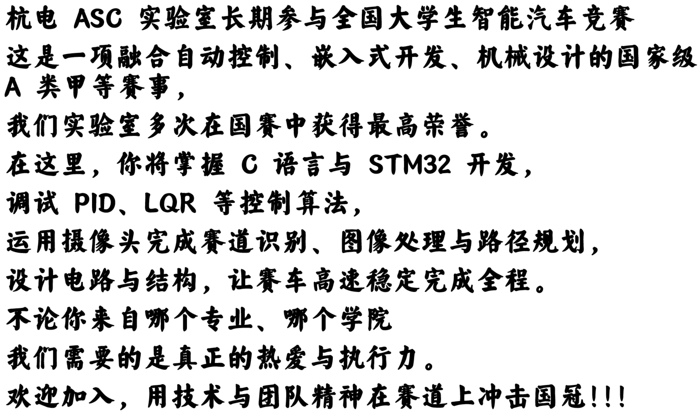

  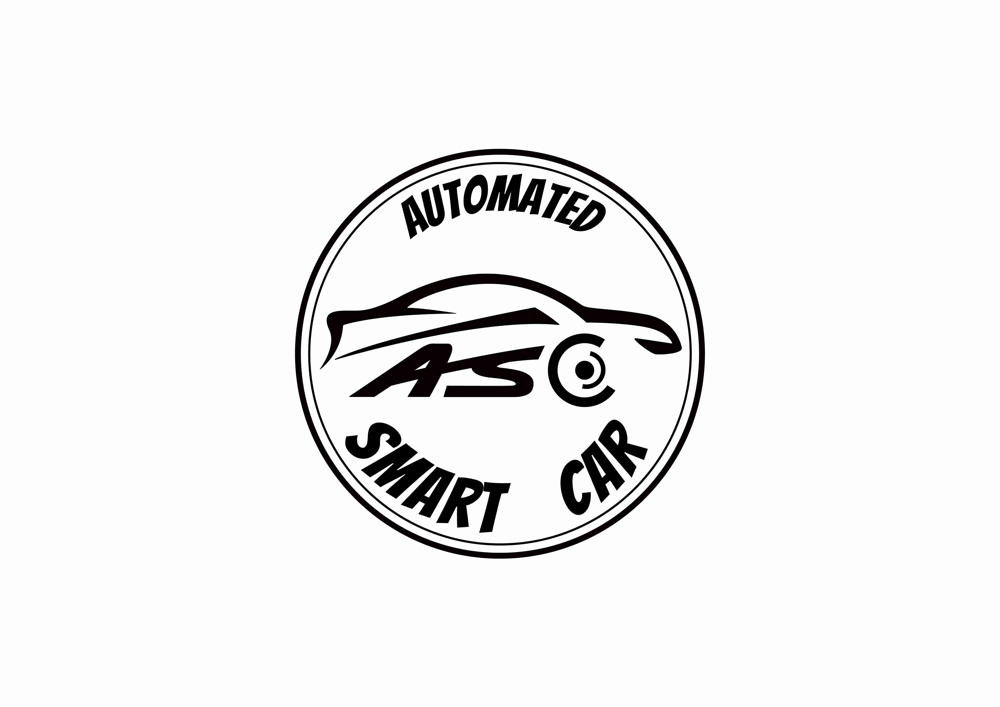

后面是我们自己设计的实验室LOGO、Slogan、纸盒、易拉宝 , 还有实验室大扫除

在2教门口开学报到站了一天招新 , 百团大战 , 科技馆的分享会 , 一轮轮的招新任务 , 都在眼前

如此寥寥数语 , 就是我的大二上的所有时间 , 没有多少照片回忆 , 不知道其中花费了多少精力 , 只知道实验室在慢慢变好 , 也许吧

## 第二十一届 : 飞跃雷区

5人队 还是 4人队

甚至是3人队

客观评价一下这个组别的难度 , 如果让我用现在的眼光回头看这个组别, 3人足矣 一个硬件 一个电控 一个结构 湘潭就是这么个搭配

但是由于招新的问题 , 我们这一届电控招了12人 , 硬件招了8人 (电控集训管的严很多,不行就踢,经常验收)(硬件集训画出了主板,有刷,排名在后面的水平都差不多那样了,硬件学长就没筛人,全让进了,虽然进之前就明确说了排名在后面的是二队跟学弟组队的), 但是到了分配组别的时候 , 为了能让这一届的硬件都打上比赛 , 很多组别都是不合理的分配 , 就这么说吧 轮腿4人队 , 出了2个硬件 2个电控 , 其中一个硬件画主控 一个硬件画驱动 , 两个电控每天起早摸黑调车 , 牢到了国特 . 我们实验室智能视觉的队伍 , 4个人 , 一个视觉 一个电控 两个硬件 , 唯一的电控还是电子信息专业的(大二课程超级多),每天晚上下课9点多来实验室调到十点五十分 , 结果省赛还是无力回天

而且在现在AI代码如此便捷的情况下 , 电控也不用那么多 , 3个电控放在任何一个组别都是绝对冗余的 , 排名靠后的电控 , 语言理解能力还不如你直接和agent对话 , 有些任务你交给能力差的软件 , 让他理解的成本 , 还不如你自己跟ai沟通对话方便。而且现在编写代码不是苦力活了 , 很多事情都可以交给AI , 反而是思路和思想更加的重要

最早赛题出来就购买了F450的机架(那个时候规则没有50cm的限制) , 然后视觉队友就开始调F450 , 调了差不多2个月 , 平衡的闭环都难 , 定高更别想了

因为一开始我去做了空地串口的通信部分 , 我们打算就是后面参数修改都放在车模上,飞机屏幕也不放,按键也不放(硬件说面积压不下去,只能缩这个东西)(一开始大二那个硬件是真的摆子,画的板子抽象至极,五向开关方向是错的,我想要往上 , 得拨动到左上角,右边是右上角,左边是左下角,下面是右下角 , 按键选型也是逆天选型 , 你说这个是缩微光电的选型的按键我都信,明明是青青草原的板子选个这么逆天的按键,板子焊接也从来不洗干净,飞个线都线头一大堆,来实验室也不来,学长的板子文件都发了,4月份有刷电机drv搓不出来,说是要换2104也是给我气笑了.[【智能车比赛最累的从来不是调车，是你拼尽全力赶进度，有些人却在拼命拖后腿】](https://www.bilibili.com/video/BV1nKPizfE84/))

后面我去调飞机了 , 用的是mark5机架。我记忆很深刻 , 就是元宵在外面吃了个烧烤 , 之后晚上随便调了两个kp , 姿态就很稳了。我严重怀疑是我研究了很久的滤波和解算 [CYT4BB7_Air/docs/01-flight-control/imu-and-attitude.md](https://github.com/ZhangStudyLife/CYT4BB7_Air/blob/national-2026/docs/01-flight-control/imu-and-attitude.md) , 导致后面一遍就起飞了。后面一步步的定高都挺自然的 , 困难的还是速度环 , 我们尝试各种速度估计和速度闭环的控制器 , 怎么效果都不是很好 , 我严重怀疑就是底下的那根线导致的光流数据一直存在很严重的问题 , 导致速度闭环难度很大

很早我们使用的是绿光方案 , 但是后续没用了 , 因为我们尝试了一下最基础的一字形状的红外灯 , 就可以很好的跟信标灯的圆心区分开

对于方案的尝试 , 我们尝试过各种坐标变化 , 不同方向的摄像头 , 不同波段的光 , 也尝试过不同的电机和桨叶

至于雷区这个项目其他的经历 , 就没什么好在这里说的了

那个时候还浪费了很多时间在结构上面 , 因为我们队没有专业的结构 , 都是谁需要结构了,然后自己使用sw建模一下 那个时候麦轮车模就是大部分就是抄逐飞的,然后改了一下底盘高度而已。

校赛输的一塌糊涂 , 虽然那个时候飞机和车模的联调都是队友调的 , 校赛那个时候的水平差不多是10个很近的灯 , 要花费50s+ , 我还在沉淀飞机的控制以及等待结构和新的方案的图像板。

然后校赛结束2天 , 板子的问题解决了 , 然后我开始联调了,明明要期末考了 , 我一学期都没学 , 可我还在实验室调车,那个时候实验室基本上只有我和蚂蚁那一队会来(他们校赛也被隔壁打败了,其他队都没咋来了)。

在校赛结束的7天后 , 终于提速到32s 10个灯

  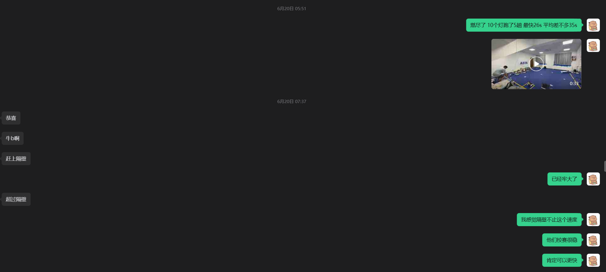

那个时候真的就是喘了一口大气 , 后面调出来之后就开始复习 , 3天模电 2天自控 1天信号+微机原理 谁懂

后面进入省赛之后几乎就是方案没变 , 就是我重新优化了各个滤波参数和姿态内环的响应重新调节 , 还有就是重新调节了速度环的参数 , 这些都可以在7月初~19日的每天提交的git记录里面看到

后面省赛运气好赢了隔壁竞争的实验室 , 他们的速度也是非常快的, 但由于竞争组别的关系 , 他们还是无法进入国赛 , 过于遗憾了 . Respect

省赛结束之后 , 一堆人都问卓大国赛赛道会不会更大 , 卓大回答:

  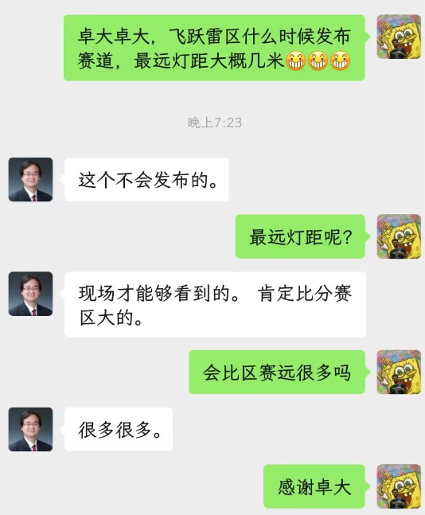

然后省赛的麦轮 , 由于结构问题只能让麦轮进行旋转 , 保证麦轮正上信标灯才行 , 效率低很多 , 而且轮子摩擦力也不行 , 加速度和减速都不太够。

于是一鼓作气改车模 , 改成F车模和小飞机

小飞机影响并没有那么大 , 确认硬件板子可以锁, 其实其结构就完全是省赛的结构 , 代码也没改 , 就是调了调参数的事情

因为很早很早我就想用35小飞机 , 可惜硬件学弟还欠缺经验 , 那个时候完赛的板子想搓出来都比较困难 , 幸好**山东工商学院**的阿牛佬给我们一路提供了很多的帮助

对于F车模的调试 , 结构上还是有所欠缺, 参考视频 [【［开源文档链接视频］21届智能车飞跃雷区杭电国赛结构方案】](https://www.bilibili.com/video/BV1894o62Ej4/)

然后国赛相比较省赛进步这么大 , 主要还是飞机的跟随做的好很多 , 去掉了速度内环 , 换成图像PD环+径向加速度前馈和向心加速度的前馈 甚至可以做到 3米遥控车能够跟上

预赛 14.5 秒杀死比赛 , 遥遥领先。到了决赛 , 图像问题很严重 , 没能发挥出正常的水平 , 其实前四名的排序就是纯运气。但赛场上就是这样 : 你调得再快 , 站上场地的那一刻 , 一切都重新算。

最终 , 冠军

[有些故事 , 适合留在最好的时候](https://www.bilibili.com/video/BV17L8J6fEYQ/)

---

这篇回忆录会一直慢慢补 , 想起什么就添什么

返回 [总仓库 README](./README.md)
